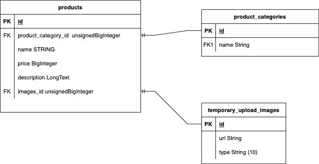
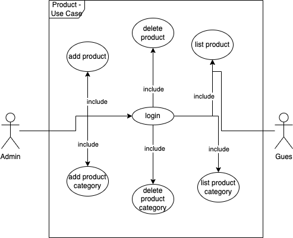

<h1>Majoo Test</h1>

<h3>Technical Documentation</h3>
<p>ERD :</p>



<p>Use Case</p>



<p>DML</p>
<p>Product Category :</p>
<p>Select Query</p>

```sql
SELECT * FROM product_categories

```
<p>Insert </p>

```sql
INSERT INTO product_categories(name,created_at,updated_at) values('test',CURRENT_DATE,CURRENT_DATE)
```

<p>Product :</p>

```sql
SELECT * FROM products
INNER JOIN product_categories pc ON products.product_category_id = pc.id
INNER JOIN temporary_upload_images tui on products.images_id = tui.id

```
<h3>How To Run</h3>

```bash
composer install
```
<h3>Migrate Database</h3>

```bash
php artisan migrate --seed
```
